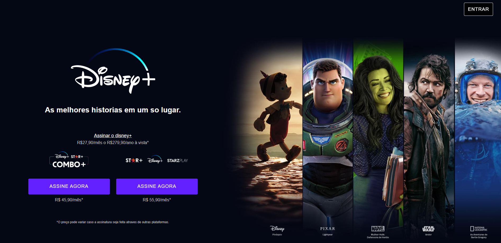

# 🎬 Disney+ Clone

Projeto educacional de um **clone da interface do Disney+**, desenvolvido como prática de um projeto completo de front-end, simulando um fluxo de desenvolvimento real: estrutura HTML, organização de estilos com **Sass**, automação de tarefas com **Gulp** e interatividade com **JavaScript**.

O objetivo foi reproduzir a experiência visual da plataforma, incluindo seções de conteúdo, planos, dispositivos compatíveis e perguntas frequentes.

🔗 Projeto online: (Ver aplicação)[https://clone-disneyplus-rho-nine.vercel.app/]

---

# 📸 Preview

---

---

---

# 🚀 Tecnologias utilizadas

---

# 📚 Conceitos praticados

Este projeto foi desenvolvido para praticar conceitos importantes de desenvolvimento front-end:

- Estruturação de páginas com **HTML semântico**
- Estilização modular utilizando **Sass**
- Organização de estilos com **partials e variáveis**
- Uso de **mixins** para reutilização de código
- Automação de tarefas com **Gulp**
- Minificação de arquivos JavaScript
- Otimização de imagens
- Criação de **componentes reutilizáveis**
- Manipulação do DOM com **JavaScript**
- Criação de **abas dinâmicas**
- Implementação de **accordion FAQ**
- Controle dinâmico do **header ao rolar a página**
- Layout **responsivo**

---

# 🧠 Funcionalidades implementadas

O projeto reproduz diversas funcionalidades presentes em páginas modernas:

### 🎞️ Navegação por abas

Na seção de conteúdos, os botões permitem alternar entre diferentes categorias:

- Em breve
- Mais populares
- Mais no Star+

Essa interação é feita com **JavaScript manipulando classes CSS dinamicamente**.

---

### ❓ FAQ com accordion

A seção de perguntas frequentes utiliza um sistema de **accordion**, onde:

- clicar na pergunta expande a resposta
- clicar novamente recolhe o conteúdo

---

### 📱 Layout responsivo

O layout se adapta para diferentes dispositivos:

- desktop
- tablets
- smartphones

Utilizando **media queries no Sass**.

---

### 🧭 Header dinâmico

O header muda seu comportamento ao rolar a página:

- próximo ao topo → logo e botão ficam ocultos
- após passar o hero → header aparece normalmente

Isso foi implementado com **eventos de scroll no JavaScript**.

---

# 🛠️ Automação com Gulp

O projeto utiliza **Gulp** para automatizar tarefas comuns no desenvolvimento front-end.

As tarefas configuradas incluem:

### Compilação de Sass

Converte arquivos `.scss` em CSS otimizado.

### Minificação de JavaScript

Reduz o tamanho dos arquivos JS para produção.

### Otimização de imagens

Compressão automática de imagens para melhorar performance.

## ▶️ Como executar o projeto
- ▶️ Como executar o projeto
    - git clone https://github.com/vitordrs/clone_disneyplus.git
- 2️⃣ Instalar dependências
    - npm install
- 3️⃣ Rodar em modo de desenvolvimento
    - npm run dev
- 4️⃣ Gerar build
    - npm run build

---

# 🎓 Objetivo educacional

Este projeto faz parte de um **módulo de prática de desenvolvimento completo**, com o objetivo de simular um fluxo real de trabalho no front-end, desde a criação da interface até a automação de tarefas e otimização de assets.

---

# ⚠️ Aviso

Este projeto foi desenvolvido **apenas para fins educacionais**, sem qualquer relação oficial com a Disney ou o serviço Disney+.

---

# 👨‍💻 Autor

Projeto desenvolvido por **Vitor dos Reis Soares** durante estudos de desenvolvimento web.